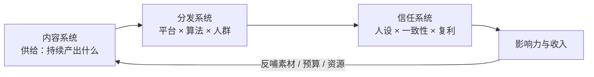
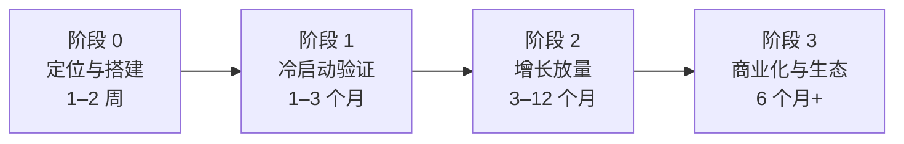
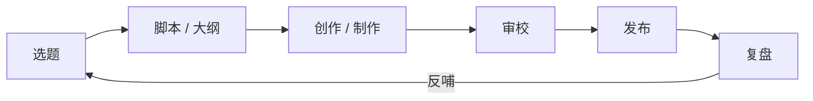
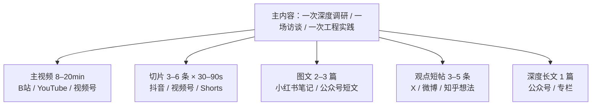

# 自媒体实战总纲

> 定位：端到端作战手册 —— 从账号定位、内容生产、多平台分发到复盘迭代的全部动作、标准与节奏。
> 视角：行业通用方法论（中立、可迁移），篇末附本品牌落地映射。
> 配套：`02-分平台手册`（各平台具体打法）· `03-运营方法论大全`（思维框架库）· `README`（导航）。
> 数据口径：文中数字为行业参考线（2026-09），随平台政策变化更新，勿当作硬指标。

---

## 1. 底层逻辑：自媒体是一门什么生意

自媒体生意的本质：**用内容持续赢得注意力，把注意力沉淀为信任资产，再把信任转化为影响力与收入。**

三个子系统互相咬合：



全书前提（任何打法违背其一即会走偏）：

1. **内容即产品**：每条内容单独看是「流量获取单元」，长期看是「信任证据」。不可为流量透支人设。
2. **账号即品牌**：账号名/头像/简介/封面构成的第一印象，是转化率最高的免费广告位，起号前一次性设计好。
3. **平台不是你的**：流量是平台的，粉丝是平台的，只有「人设认知 + 私域 + 作品库」是自己的。任何单一平台上的资产都要假设有一天会归零。
4. **复利优先**：优先做能被搜索、被收藏、被引用、随时间增值的内容（常青资产），少做一次性消耗品。
5. **数据是信号不是成绩**：数据用来做假设、做实验，不是用来焦虑。

---

## 2. 从 0 到 1：四阶段作战地图



| 阶段 | 唯一目标 | 关键动作 | 阶段完成标准（不达标不前进） |
|---|---|---|---|
| 0 定位与搭建 | 明确「为谁、提供什么、凭什么」 | 定位三角分析；一句话定位；内容支柱 ×3–5；账号装修（名/头像/简介/封面模板）；竞品拆解 10 个；攒 30+ 天选题储备 | 定位文档定稿 + 选题储备到位 + 账号全套装修完成 |
| 1 冷启动验证 | 找到「能稳定的爆款原型」 | 固定节奏发布（建议周 2–3 条，重度日更）；每批做 A/B；前 100 条内刻意寻找爆款结构；把互动当需求信号 | 至少 1 个内容原型稳定超平台基线（见 §5 参考线）；内容→涨粉路径打通 |
| 2 增长放量 | 把「偶发爆款」变「稳定产出」 | 爆款结构复制（复制结构，不是复制选题）；系列化/栏目化；跨平台分发矩阵；私域承接 | 爆款率稳定（>30% 内容超基线）；粉丝进入平台商业化门槛量级（参考：B站/小红书/抖音 ≥1 万） |
| 3 商业化与生态 | 把流量变成可持续收入 | 按 03 §6 选择变现组合；流量导自有资产（作品库/私域/产品）；团队化拆解（见 §7） | 单条收入流跑通 → 组合收入流互相供血 |

**阶段纪律**：
- 上一阶段指标达标且**稳定 2 周以上**才前进；跳级的代价是返工。
- 阶段 1 最常见的死法：没到 100 条就换定位。定位可以微调，不可以每周换。
- 阶段 2 最常见的死法：追爆款追到人设分裂。只复刻「结构」，不复刻「选题」，守住支柱。

---

## 3. 内容生产流水线 SOP

### 3.1 六环节流程



### 3.2 各环节产出物与标准

| 环节 | 产出物 | 合格标准 | 常见失败 |
|---|---|---|---|
| 选题 | 选题卡：主题/目标人群/角度/标题草稿 ×3/支柱归属 | 与内容支柱对齐；有搜索价值或情绪价值；能一句话说清「说给谁听」 | 只问「我觉得有意思」，不问「对谁有用」 |
| 脚本 | 脚本或大纲：钩子（前 3 秒/前 100 字）→ 结构 → CTA | 结构完整（钩子-价值-收尾）；每 30 秒一个信息点；留了埋点（互动引导） | 平铺直叙、无钩子、无结论 |
| 创作 | 成稿/成品文件 | 符合目标平台规格（见 02）；完成度 100%（不是 80% 就发） | 超长注水、结构散、素材凑数 |
| 审校 | 审校记录（可单人执行） | 过 §4.3 清单；事实/数据/引用已核验；版权干净；无错别字硬伤 | 发布后才发现硬伤，删了重发伤权重 |
| 发布 | 全渠道适配版本（标题/封面/文案各平台一版） | 主平台优先发布，其余平台 1–48h 内同步；黄金 2h 内回复互动 | 一份文案复制粘贴全平台 |
| 复盘 | 复盘笔记：数据结果 + 假设（为什么）+ 可复制结构 + 下次实验变量 | 发布 24–72h 后完成并归档 | 发完不管，或只看赞数 |

### 3.3 工时预算（单人创作，周产 2–3 条主线内容）

| 环节 | 初学 | 熟练 | AI 加持 |
|---|---|---|---|
| 选题（含调研） | 3h | 1.5h | 1h |
| 脚本/大纲 | 4h | 2.5h | 1.5h |
| 拍摄/制作 | 6h | 4h | 3h |
| 剪辑 | 6h | 3h | 1.5h |
| 发布矩阵 | 1.5h | 1h | 0.5h |
| 复盘 | 1h | 1h | 0.5h |
| 合计/条 | ≈21h | ≈13h | ≈8h |

总原则：**先固定节奏，再优化效率**。节奏碎了，一切方法论失效。

### 3.4 一鱼多吃工作流（同一次投入，多形态产出）



规则：
- 素材**一次采集**（如一次田野调查：录音、照片、数据、现场视频全收），多形态加工。
- 主内容决定质量上限，切片决定流量下限；切片是「再次分发」，不是「重新创作」。
- 每星期留 20% 产能给「无主题产能」：灵感视频、水日常、评论区催更内容。

---

## 4. 质量红线与发布前检查

### 4.1 内容质量红线（违反即返工或下架）

1. **事实性错误 / 未核验数据**：行业数字、他人观点必须溯源。数字出错一次，信任资产折损一年。
2. **标题党与内容不符**：高跳出 = 废流量 + 账号降权，平台会记住你的差评用户。
3. **版权问题**：BGM/视觉素材/字体/他人内容，一律确认授权或无版权。平台原创保护与版权投诉都会直接锤账号。
4. **营销感过重**：硬广无标注、夸大功效。「有用 + 真诚」是信任资产的复利，广告是消费它。
5. **情绪挑拨/对立引流**：短期流量、长期灾难，且会被平台标记为低质内容。
6. **隐私与泄密**：他人隐私、未公开信息、内部资料。这是法律问题不是风格问题。
7. **结构残缺**：无钩子、无结论、烂尾。宁可少发一条，不发半成品。
8. **低级错误**：错别字、字幕错、封面错。低级错误毁掉「专业」人设只需一条。
9. **零沉淀的纯消耗**：每条内容应有可沉淀点（观点/方法/数据/作品），纯段子式流量会越做越累。
10. **人设断裂**：内容风格与定位断裂，用户会困惑「你是谁」，取关成本极低。
11. **田野调查红线**：受访者须知情同意 —— 出镜、录音、引用其发言都要获得明确授权；涉及敏感信息一律脱敏处理；访谈素材长期存档。对「田野调查」定位的账号，这既是伦理底线也是法律底线。

### 4.2 平台合规红线（通用，细则见 02 各章）

- ❌ 违规导流：平台外联系方式硬广（微信等），各平台有具体话术与处罚机制
- ❌ 无资质内容：医疗、金融投资、法律建议等需要资质的内容
- ❌ 违法灰产：灰黑产、黄赌毒、诈骗话术
- ❌ 诱导互动：关注/点赞/转发换奖品（多数平台违规）
- ❌ 搬运抄袭：查重降权、封号，且毁账号声誉

### 4.3 发布前 10 项检查清单

```
[ ] 选题与内容支柱对齐（能说出支柱名）
[ ] 事实 / 数据 / 引用已核验（源头可查）
[ ] 版权干净（素材 / 音乐 / 字体）
[ ] 钩子成立（前 3 秒 / 前 100 字有明确钩子）
[ ] 标题 ≥3 版，已选最优（符合平台字数与规范）
[ ] 封面 / 首图小图清晰可读（放缩到 20% 还能看清）
[ ] 平台规格匹配（时长 / 比例 / 标签 / 分区）
[ ] 无错别字、无硬伤（读一遍 / 播一遍）
[ ] 导流与合规自查（无违规词与话术）
[ ] 存档备份（脚本 + 成品文件已归档，方便复用）
```

---

## 5. 数据指标体系

### 5.1 北极星指标

对创作者最稳的北极星：**已验证爆款结构的数量 × 稳定触达人群**。实操上简化为：

> **月爆款率** = 当月内容中，互动率超该平台基线 2 倍以上的条数 ÷ 当月发布条数（目标 ≥30%）

爆款率 = 每一条都在训练你的「结构库」，是唯一有复利的数据。
健康线分平台而异（如小红书图文生态 10% 即算健康，见 02 各章「数据健康线」）；北极星看趋势不看单周，单周波动属常态。

### 5.2 三级指标（统一口径）

| 层级 | 指标 | 说明 |
|---|---|---|
| 曝光层 | 曝光量、进入率（CTR）、前 3 秒留存 | 衡量「选题 + 封面 + 开头」；CTR 低换封面，留存低换开头 |
| 互动层 | 完播率、赞/评/藏/转、涨粉率、分享率 | 衡量内容价值密度；平台推流的主要依据 |
| 转化层 | 主页访问、私域引流数、咨询数、GMV | 衡量商业效率；只有这一层直接对应收入 |

注意口径差异：各平台「播放」定义不同（抖音=开始播放，B站=有效播放时长门槛），**数据只跟同一平台自己比**，跨平台不可比。

### 5.3 健康参考线（参考非标准）

| 指标 | 参考线 | 说明 |
|---|---|---|
| 短视频完播率 | ≥30%（1min 内） | 低于 20% = 开头有问题 |
| 视频长完播率 | 30–40%（8min+，分平台口径见 02） | 低于 30% = 信息密度不足或选题过泛 |
| 封面点击率 CTR | 4–10%（YouTube） | <3% 换封面；>15% 但内容留不住 = 标题党 |
| 图文互动率 | 3–5% | 小红书/公众号参考 |
| 涨粉率 | 1–3%（涨粉/播放） | <1% 检查 CTA 与人设引力 |
| 分享率 | ≥3%（转发/播放） | 分享 = 你击中了「帮我表达」的需求 |

> 参考线来源：平台官方公开口径 + 一线运营经验值（不逐条标注）；校准节奏见 §6.4。

---

## 6. 运营节奏 SOP

### 6.1 每日（约 30–60 min）

- 看昨日发布内容数据（10 min）：只做两件事 —— 记录超基线/低于基线，写一句假设
- 回复评论与私信（黄金 2h 内至少回一轮）
- 收集 3 个选题灵感进选题库（看到什么记什么，勿当天判断）
- 维护内容日历（今天该产出什么、明天发什么）

### 6.2 每周（固定半天）

- **排产会**（30 min）：定下周 3–5 个选题（用 03 §2.3 评分卡）
- 产出 2–3 条主线内容（按 §3 流水线）
- **周复盘**（30 min）：本周最强/最弱各 1 条，提炼结构与假设，写入复盘笔记

### 6.3 每月（固定半天）

- 月度复盘：支柱覆盖统计、各渠道健康度、粉丝增长归因（哪条内容带来了哪批人）
- 下月内容计划：按支柱分配选题
- 竞品扫描一次：拆解 2–3 个同行/半同行账号的新打法

### 6.4 每季度（固定一天）

- **定位复核**：人设/受众/支柱还在射程内吗？粉丝结构变了没有？
- **渠道取舍**：每个渠道单独算账 —— 投入产出比，停更弱渠道、加注强渠道
- **商业化里程碑**：对照阶段地图（§2）检查是否该切换阶段
- **数据校准**（逢 1 月、7 月当季执行）：对照各平台官方「规则中心 / 创作者学院」最新口径，更新 02 各章参考线与机制描述（见 README 维护约定）

---

## 7. 工具链（2026-09 行业标准）

### 7.1 单人创作者工具栈

| 场景 | 免费/平价 | 付费进阶 |
|---|---|---|
| 选题/日历/知识库 | 飞书 / Notion | 同上 + 数据分析插件 |
| 剪辑 | 剪映 / CapCut | 达芬奇（调色） |
| 封面/视觉 | Canva / 稿定 | 设计外包（单张 50–200 元） |
| 配音/音频 | 剪映 AI 配音、Audacity | ElevenLabs |
| 图文排版 | 135 编辑器 / 秀米 | — |
| 数据 | 各平台创作中心 | 新榜 / 蝉妈妈 / 灰豚 等（按需） |
| 直播 | 平台原生 | OBS + 直播伴侣 |

### 7.2 AI 辅助工作流（行业标准分工）

> **AI 负责规模，你负责判断与人格。**

- 选题：AI 批量出候选 → 你用评分卡筛（AI 不做最终裁定）
- 脚本：你自己出大纲 → AI 扩写 → 你重写关键段落（人格段落必须人写）
- 创作：AI 生成初稿底稿 → 人审校重写 → 成稿
- 切片：AI 脚本辅助找爆点 → 人工定稿
- 禁止：AI 直发不审（内容人格即品牌，交给模型 = 品牌外包）、AI 生成虚假经历/数据

---

## 8. 账号健康与长期主义

1. **节奏 > 爆发**：能稳定做 2 年的节奏，好过能爆发 2 个月的节奏。断裂期会让算法和粉丝双重遗忘。
2. **一致性 > 热点**：人设一致性是长期资产；蹭热点是短期贷款。
3. **复利内容占比 > 50%**：常青内容（方法、案例、数据、作品）形成长尾流量池，热点只做催化剂。
4. **给自己留安全边界**：露脸、隐私、数据焦虑都要有提前预案；内容产能和心力是双燃料，只烧一个会熄火。
5. **季度体检**：粉丝结构 / 支柱健康度 / 渠道依赖度（单一平台占比 >70% 视为风险）/ 人设漂移检查。

---

## 9. 落地本品牌（me-os）

本品牌定位：**基于极致工程的田野调查者** —— 第一性原理 + Maxing Everything + 田野调查（视频为主线）+ build in public。

### 9.1 渠道优先级建议（对应 02 手册）

| 角色 | 平台 | 投入占比 | 内容形态 |
|---|---|---|---|
| 视频主线 T1 | B站、YouTube、视频号（长视频）+ 抖音（切片矩阵） | 60% | 田野调查长视频 8–20min、工程复盘、主视频切片 30–90s |
| 图文中继 T2 | 小红书、公众号、知乎 | 30% | 知识卡、深度长文、方法论问答 |
| 轻量广播 T3 | X、微博 | 10% | build in public 流水账、观点短帖 |

### 9.2 内容支柱 → 形态映射（示例）

| 内容支柱 | 主线形态 | 分平台形态 |
|---|---|---|
| 田野调查 | 访谈/观察长视频（B站/YouTube/视频号） | 小红书故事笔记、知乎方法论回答、X 实录 Threads |
| 极致工程 | 工程复盘视频 + 数据可视化 | 公众号深度文、B站专栏、小红书干货卡 |
| build in public | 月度产品演讲视频 | X 日更流水账、微博进展播报、视频号直播切片 |

> 回填约定：支柱名称与描述以品牌控制台实际记录（BrandPillar）为准，定稿后回填本表（见 README 维护约定），当前为示例映射。

### 9.3 一鱼多吃设计（一次田野调查的完整矩阵）

> 调研录音 + 现场物料一次采集 → 主视频（15–20min）→ 切片 4–6 条（抖音/视频号/Shorts）→ 小红书故事笔记 2 篇 → 知乎方法论回答 1 篇 → 公众号深度文 1 篇 → X/微博实录 5 条。

### 9.4 第一阶段（未来 90 天）优先级动作

1. 跑通 **B站 + 视频号 + YouTube 周更 1 条主线视频**（同一期内容三平台同时发，文案各自适配；并按 §3.4 产出切片 4–6 条分发抖音/视频号）
2. 小红书/公众号承接图文版（每周 1–2 篇）
3. X 每日 build in public 流水账（5 min/天）
4. 用 03 §7 复盘模板，每条内容 72h 内完成复盘归档

---

> **一句话总纲：定位不移，爆款复制结构，复利优先，复盘迭代。**