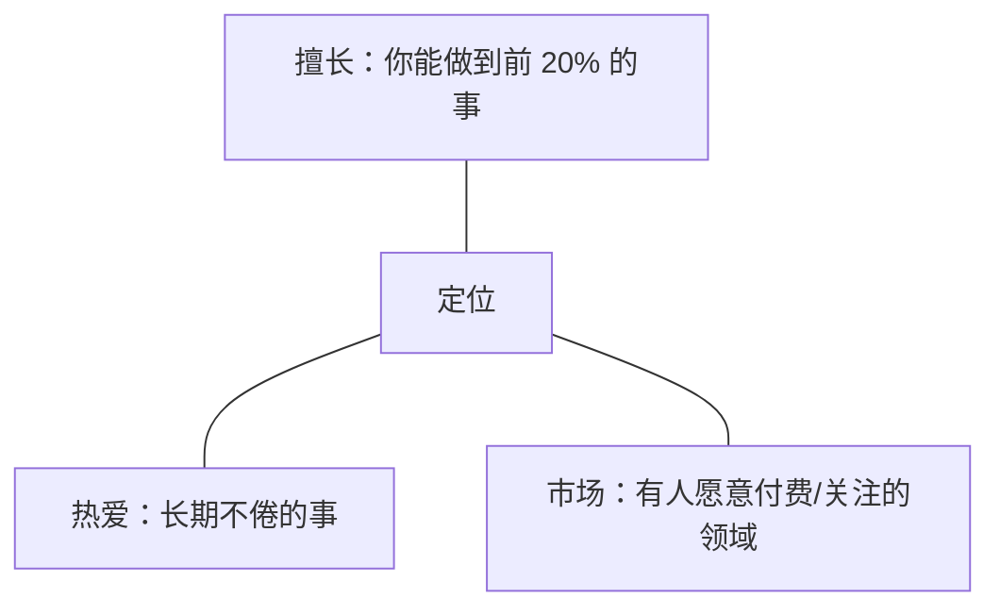
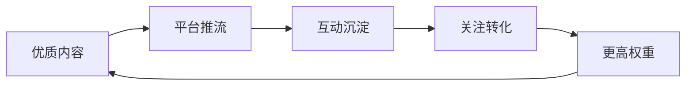
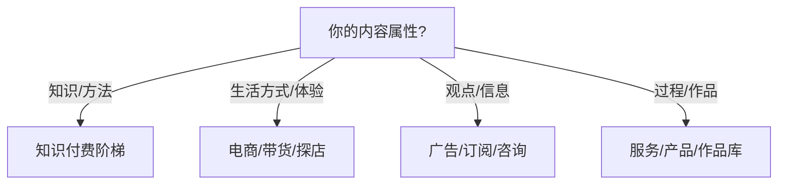

# 运营方法论大全

> 定位：思维框架库 —— 定位、选题、创作、分发、增长、商业化、复盘、规模化与 AI 的模型与方法。每条按「定义 / 适用场景 / 步骤 / 示例 / 常见错误」组织，需要时取用，不要求通读。
> 配套：执行节奏与指标见 `01-实战总纲`，各平台差异见 `02-分平台手册`。
> 数据口径：与 01/02 同源，2026-09 更新。

---

## 1. 定位方法论

### 1.1 定位三角（擅长 × 热爱 × 市场）

- 三圆交集 = 最佳定位；两圆交集可先起步（补上第三圆），一圆 = 不要做。
- 判断「擅长」：不是自我感觉，是**证据**（作品/结果/他人认可次数）。
- 判断「热爱」：过去半年里，哪些事你做了不觉得耗能。
- 判断「市场」：平台上同垂类头部账号的收入结构、涨粉速度、付费产品存在性。

**常见错误**：只凭热爱入场（供给过剩）；只凭市场入场（做不下去）。定位可微调，但方向与支柱一旦定下，至少执行 3 个月再评估。

### 1.2 一句话定位公式

> 我为 **【人群】** 解决 **【问题】**，用 **【差异点】**，最终带来 **【结果】**。

示例：「我为想要掌控人生的工程师，解决『知识分散、行动混乱』的问题，用一整套工程化的个人系统（第一性原理 + 极致工具），最终带来可量化的生活与事业产出。」

- 检验：把「我」换成任意同名账号，如果依然成立 → 差异点不够。
- 检验：目标人群能 3 秒内判断「讲的是不是我」 → 人群描述要贴着他们的语言。

### 1.3 内容支柱法（3–5 个支柱）

- 每个支柱 = 一个可持续的「子赛道」，有独立受众、独立选题池、独立增长曲线。
- 支柱选择标准：① 你愿意连续做 2 年；② 有搜索需求；③ 彼此能交叉引用。
- 支柱不是栏目名，是**选题边界**：任何选题先归支柱，归不进去的默认不做。

**常见错误**：支柱太多（精力分裂）、支柱太窄（没选题）、支柱之间的内容互相打架（人设混乱）。

### 1.4 定位验证（30 天市场反应）

发布 30 天后看三个信号：

1. **谁在互动**（评论区画像是否等于目标人群）
2. **什么被收藏**（收藏 = 用户觉得「对我有用」的证据）
3. **什么被问**（评论区的提问是最真实的选题需求）

信号与定位不符 → 微调定位再跑 30 天；相符 → 加大投入。

---

## 2. 选题方法论

### 2.1 选题四象限与占比

| 象限 | 定义 | 建议占比 |
|---|---|---|
| 常青 | 永远有人搜的问题（教程/方法/原理） | 60% |
| 痛点 | 目标人群当下最疼的问题（可结合时事） | 20% |
| 热点 | 借势热度（时效 24–72h） | 10% |
| 爽点 | 情绪/围观型内容（引流拉新） | 10% |

理由：常青内容构成「搜索资产」和「信任地基」，热点与爽点负责拉新。占比稳定，人设就稳定。

### 2.2 需求挖掘五渠道

1. **平台下拉词/搜索联想**：输入领域词，看平台给你补什么 —— 那是平台验证过的高频需求。
2. **自己内容评论区**：评论区提问 = 免费问卷。
3. **竞品评论区**：同垂类大号的评论区是需求金矿（他们不回答的问题就是你的机会）。
4. **问答平台**（知乎/百度知道/Quora）：问题即需求，且自带搜索量。
5. **行业数据与报告**：工具榜单、年度报告、招聘需求的变化 = 趋势信号。

### 2.3 选题评分卡（每个选题 0–5 分，总分 20 分制）

| 维度 | 问法 | 分值 |
|---|---|---|
| 需求强度 | 目标人群在主动搜/主动问吗？ | 0–5 |
| 竞争度 | 已有爆款的数量与质量（有机会挤进去吗） | 0–5 |
| 能力贴合 | 我能给出超出平均水平的答案吗 | 0–5 |
| 复利性 | 一年后它还值得被看到吗 | 0–5 |

≥16 分优先做；12–15 分排期；<12 分除非顺手否则放弃。**每周排产会筛 10 进 3**（对应 01 §6.2）。

选题库字段结构（建议）：主题 / 来源 / 目标人群 / 内容支柱 / 四象限 / 评分 / 状态。品牌侧选题库以 `docs/brand/DESIGN.md` 及品牌执行手册为准，本目录不重复维护模板。

### 2.4 复利选题原则

- 选题优先选「一次投入、多形态产出、长期有效」的：可做视频 + 图文 + 问答 + 模板。
- 每条内容留一个「可复用资产」：模板、清单、方法论、数据表 —— 资产会自己长尾。

---

## 3. 内容创作方法论

### 3.1 钩子公式（黄金 3 秒 / 前 100 字）

钩子的四种原料，可组合：

1. **冲突**：「我用一年做了个别人 3 天就能抄走的东西，但结果出乎意料」
2. **悬念/反转**：「先看结论：这张表能省掉你 80% 的重复工作」
3. **利益前置**：「这套清单我用了 3 年，今天全给你」
4. **反常识**：「刷手机越久越累？因为你在做无效决策」

检验：钩子需要「承诺」，承诺需要在内容里兑现；兑现不了 = 标题党（红线）。

### 3.2 内容结构三件套

- **开头**：钩子 + 承诺 + 时间线（「今天告诉你三个方法，来自 X 次真实实践」）
- **中间**：三选一 —— 并列式（3 个点）+ 递进式（由浅入深）+ 叙事式（冲突-转折-解决）
- **结尾**：总结（一句话可带走）+ CTA（关注/收藏/评论/行动，一次只要一个）

### 3.3 价值四类型（每条内容至少占一类，最好两类）

| 类型 | 用户得到的 | 典型形态 |
|---|---|---|
| 实用价值 | 学会/省时/避坑 | 教程、清单、模板 |
| 情绪价值 | 被理解/爽/共鸣 | 观点、故事、吐槽 |
| 社交货币 | 有谈资/能转发 | 洞察、数据、锐评 |
| 信任背书 | 判断依据 | 案例、实测、过程 |

### 3.4 一鱼多吃矩阵

见 `01 §3.4`。核心原则：**素材一次采集，形态分别加工；主内容管质量，切片管流量。**

### 3.5 系列化与栏目化

- 栏目化 = 固定名称 + 固定结构 + 固定发布频率（用户形成预期，算法形成识别）。
- 一个栏目跑通（数据稳定超基线）后再开第二个；同时跑不超过 2 个栏目。
- 系列化让「断更」有缓冲：合集让用户追更，而不是遗忘。

### 3.6 标题与封面科学

- 标题：数字、冲突、结果、悬念、关键词前置；5 版选优（写 5 个不同角度再挑）。
- 封面：小图可读（20% 缩放下仍清晰）；一屏信息说完；固定版式形成识别度。
- 标题 × 封面 = CTR（点击率）；CTR 差 → 换封面优先于换内容。

---

## 4. 分发与流量方法论

### 4.1 平台流量四通道

- **推荐流**（算法判断「它觉得谁会喜欢」）→ 面向泛兴趣，内容要有普适钩子
- **搜索流**（用户主动找）→ 面向确定性需求，内容要有关键词与 SEO
- **社交流**（朋友/圈子转发）→ 面向关系信任（视频号/朋友圈形态）
- **关注流**（粉丝主动看）→ 面向人设资产，内容要有系列与 CTA

主战场 = 找到你内容最适合的两条通道重点经营（如视频号 = 社交 + 搜索）。

### 4.2 发布节奏

- 节奏固定 > 发布数多：每周固定日/固定时段发布，比「不定期多发」健康。
- 时段通用参考：工作日 12:00–13:00、18:00–23:00；各平台峰值见 02 各章（睡前 22:00 前后是多数平台黄金档）。
- 发布后黄金 2h：用 10–20 分钟回复前 50 条互动（互动率影响推流）。

### 4.3 多平台矩阵

- 主战场（1–2 个）做「完整版深度内容」；分发平台做「切片/图文/观点」。
- **同一内容，不同壳**：B站讲究信息密度，小红书讲究收藏价值，X 讲究观点锐度 —— 壳不同，人设一致。
- 分发顺序：主平台先发 → 24h 内铺分发平台（避免同质化判定在跨平台同时出现）。

### 4.4 冷启动三板斧

1. **内容自测**：发布前用「如果我是目标用户，凭什么看完」审一遍。
2. **社群首发**：先在私域小群试水，收集第一轮真实反馈再公发。
3. **跨平台导流**：A 平台内容是 B 平台的「钩子」（视频简介、回答末尾、主页链接、评论区置顶）。

---

## 5. 增长方法论

### 5.1 涨粉飞轮

卡点诊断四问：没流量 → 看选题/封面（CTR）；有流量没互动 → 看钩子/结构（完播）；有互动没涨粉 → 看 CTA 与人设引力；涨粉但掉粉 → 看人设一致性。

### 5.2 爆款复制（核心方法论之一）

- 爆款之后拆结构：**选题类型 + 钩子写法 + 结构骨架 + 信息点密度 + 表现方式**，写进你的「结构库」。
- 复制的是结构，不是选题（复制选题 = 抄袭 + 阉割复利）。
- 结构库检验：用同结构做 3 个不同选题，能稳定超基线 → 结构成立。

### 5.3 爆款承接

爆款出现 48h 内必须更新一条「同系列内容」，否则流量过路不留人。承接内容：该主题的第二部分/清单版/答疑版。

### 5.4 跨平台导流（合规版）

- 合规永远优先：平台禁止的导流动作（裸报微信等）不做；用「主页简介 + 合集 + 评论区置顶 + 文章内链」合规路径。
- 导流目标单一化：一次只导一个地方（专栏/私域报名链接/作品库，三选一）。

### 5.5 合作增长

- 同行互推（同量级、互补人群）；共同创作一期内容（成本 1+1<2，流量 1+1>2）；评论区互动（真实双向）。
- 原则：只与「价值观兼容、人群互补」的账号合作；合作内容也要过质量红线。

---

## 6. 商业化方法论

### 6.1 变现路径选择树

同行参考：看同垂类头部 3 个账号的变现结构（广告占比、产品价位、私域动作），找到与你「内容属性」匹配的组合，不要照抄「谁赚钱抄谁」。

### 6.2 商业化时机（信任力 > 粉丝数）

- 触发条件：互动率超基线 + 私域转化率（如咨询→付费 ≥5%）站出来，即使粉丝不足 1 万也可以先跑低价产品。
- 反向警示：粉丝数到了但互动率低 = 僵尸粉/泛粉，先修内容再谈变现。
- 粉丝数是成绩单，信任力是存款 —— 商业化花的永远是存款。

### 6.3 产品阶梯

| 档位 | 形态 | 价格参考 | 作用 |
|---|---|---|---|
| 免费 | 核心内容/模板 | 0 | 建信任、圈人群 |
| 低价 | 模板包/电子书/小课 | 9.9–99 | 筛选付费用户、测需求 |
| 中价 | 系统课/训练营 | 399–999 | 主力收入 |
| 高价 | 私教/咨询/社群 | 1000+ | 利润与背书 |

纪律：**升阶梯前提是上一档卖得动**；免费内容永远不克扣（那是漏斗口）。

### 6.4 公域 → 私域 → 成交

- 公域内容回答「值得关注吗」；私域回答「值得信任吗」；产品回答「值得付费吗」。
- 私域动作：社群（免费价值群 + 付费群）、朋友圈经营（不是广告墙，是证据墙）。
- 高客单成交靠「过程可见」：build in public 本身就是销售信。

### 6.5 商单避坑

- 选品匹配度 > 单价：给「人生系统」人设的账号推理财课 = 透支信任。
- 硬广必标注（各平台报备流程见 02）；一个月商单不超过内容量 20%。
- 接单前自问：如果我买了会踩坑吗？答案存疑就拒。

### 6.6 直播作战要点

- **定位**：直播是信任放大器，不是流量引擎 —— 先有内容或社群信任，再开播才有意义。
- **冷启动**：每场 30–60min；固定每周同一天同时段（形成预期）；前 5 场目标只是「聊起来」，不是销量。
- **标准结构**：暖场（5min）→ 主题内容（20–30min，当天最有价值的一段）→ 互动答疑（10–20min）→ CTA（最后 5min，一次只推一个）。
- **核心指标**：场均在线、平均停留时长、转粉率、互动数；**直播切片是次周短视频的免费素材**（一鱼多吃）。
- **带货纪律**：只推自己验证过的东西（自购/实测）；直播是「信任货币」的兑现，当场翻车毁一年。
- **雷区**：无人场硬播、上来就卖、挂机刷数据、承诺不兑现（发货/售后）。

### 6.7 私域与社群运营要点

- **定位**：私域是公域信任的「储蓄罐」，负责高客单与复购；公域回答「值得关注吗」，私域回答「值得信任吗」。
- **三层结构**：流量群（公域导入，免费价值）→ 主题社群（有门槛，深度价值）→ 付费圈（产品层）。逐层筛选，不要一锅炖。
- **朋友圈不是广告墙，是证据墙**：约 70% 价值内容（过程/案例/思考）+ 20% 互动（提问/投票）+ 10% 转化。
- **入群 SOP**：公域内容 CTA → 自动回复发入群方式 → 欢迎语 + 群规 + 首日破冰任务（自我介绍/一个提问）。
- **核心指标**：入群率、7 日留存、私聊转化率（咨询→付费 ≥5% 可加大私域投入）；私域追质量不追规模。
- **雷区**：轰炸式营销、广告刷屏、群 3 个月无动静成死群；私域导流动作必须过 01 §4 平台合规红线。

---

## 7. 数据与复盘方法论

### 7.1 单篇复盘四步（GRAI 变体）

1. **数据事实**：只记录数字（完播/互动/涨粉/转化），不评论。
2. **归因假设**：写出「我觉得是因为……」，区分可控变量（开头/选题/封面）与不可控（热点/算法波动）。
3. **结构提炼**：把验证有效的点拆进结构库（见 5.2）。
4. **下轮实验**：下次发布只改一个变量（A/B 思维：一次改动才有归因）。

### 7.2 周期复盘（周/月/季）

- 周：最强/最弱各 1 条 → 结构库增删。
- 月：支柱覆盖、渠道健康、涨粉归因（这批人因哪条内容而来）。
- 季：对照阶段地图（01 §2）检查阶段、渠道取舍、定位复核。

### 7.3 实验思维

- 每期发布至少一个「可比较变量」（换钩子、换封面、换时长、换 CTA），记录在案。
- 复盘最怕「什么都改了，不知道是哪个起效」；一次一个变量是纪律。

---

## 8. 规模化与 AI 方法论

### 8.1 流水线拆解（五角色）

选题策划 → 脚本 / 创作 → 制作（拍摄/剪辑/排版）→ 发布运营 → 数据复盘。

- 单人 = 五角色一人轮换；轻团队 = 把「制作」和「发布运营」外包/工具化，人只保留「策划 + 创作 + 复盘」。
- 外包边界：剪辑/配音/图文排版适合外包；**选题与人设表达不可外包**（那才是账号本身）。

### 8.2 团队化时机

月收入稳定覆盖 1 个兼职成本 + 内容产能成为瓶颈时，才考虑外包；否则先优化工作流（AI + 模板 + 批量），人的成本是产能的 10 倍时再说。

### 8.3 AI 工作流（2026 行业标准）

| 环节 | AI 角色 | 人的角色 |
|---|---|---|
| 选题 | 批量出候选 + 评分卡初筛 | 用 2.3 评分卡终裁 |
| 脚本 | 大纲扩写、改写多版本 | 结构与人格段落亲手写 |
| 制作 | 切片脚本、字幕、配音、封面底稿 | 审美终审 |
| 分发 | 多平台文案改写 | 一平台一定位的把关 |
| 复盘 | 数据汇总、归因初稿 | 判断与决策 |

铁律：**AI 负责规模，人负责判断与人格**；AI 生成的事实与经历必须人工核验，否则等于自动制造信任事故。

### 8.4 矩阵账号（慎入）

- 多账号 = 选题 × 2、人设 × 2、复盘 × 2 —— 只有团队化后才值得。
- 个人做矩阵的常见结局：两个账号都半死不活。一个账号跑通结构 > 两个账号各自流浪。

---

## 9. 心态与长期主义

1. **均值回归**：数据波动是常态；单条崩溃 ≠ 退步，单条爆款 ≠ 起飞。看 30 天移动平均。
2. **复利清单**：每月问自己 —— 这个月积累了哪些可复用资产（作品、结构、粉丝、私域、方法、案例）？答不出来就是白干。
3. **反脆弱**：单平台依赖 >70% 视为风险（对策见 5.4 导流与矩阵）；内容资产（作品库/文档）永远备份在自己手里。
4. **心力管理**：更新节奏按心力设计，不留余力给焦虑；数据报表只在固定时间看（如每日 10 分钟，见 01 §6.1）。
5. **长期主义的残酷版本**：前 100 条内容大多无人问津是常态；爆款率是训练出来的，不是等出来的。

---

## 10. 落地本品牌（me-os）

本品牌定位：基于极致工程的田野调查者（视频主线 + build in public）。

### 10.1 核心方法论五选（先吃透这五个）

1. **定位三角 + 一句话定位**（§1）→ 已定稿于 docs/BRAND.md，每季度复核
2. **选题四象限 + 评分卡**（§2）→ 排产会的固定工具
3. **钩子公式 + 结构三件套**（§3）→ 每条内容的生产标准
4. **爆款复制 + 结构库**（§5.2）→ 每两条内容做一次结构提炼
5. **单篇复盘四步 + 实验思维**（§7）→ 72h 复盘归档

### 10.2 每周弹药（周复盘时自检）

- 本周用了哪 2 个方法论？结果验证了吗？
- 结构库新增/删改了哪条？
- 下周只改一个变量是什么？

### 10.3 Build in public 特化方法

- 公开你的过程（调研计划、数据、决策原因、失败），把「过程」本身做成内容 —— 这是本品牌与泛知识账号最大的差异化。
- 用数据说话（田野调查的原始数据是内容金矿），但守住隐私与商业边界红线（01 §4.1）。

---

> **方法论不是知识库，是肌肉记忆：每条方法论只有被使用并复盘过，才真正属于你。**